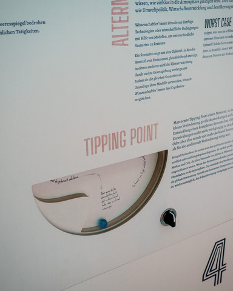

# Tipping points

In complex systems, a tipping point is where a small change in the system makes big differences in its evolution. Often, these changes are irreversible, or it takes much more effort to reverse than was necessary for the triggering change.

This repository contains construction plans for a hands-on exhibit that demonstrates tipping points in a simple system: A ball rolling on a track contained in a disc whose rotation is controlled by the visitor.



## Disc with tipping points

The layout/graphics files are available for the German version of the disc in the `plans` folder. Cut out the different layers of the disc similar to the photo above.

## Electronics parts list

- Stepper motor: [Nema 17 Stepper Motor Bipolar L=48mm with Gear Ratio 5:1 Planetary Gearbox](https://www.omc-stepperonline.com/de/nema-17-schrittmotor-bipolar-l-48mm-mit-uebersetzungsverhaeltnis-5-1-planetengetriebe-17hs19-1684s-pg5)
- Micro controller: [Arduino Uno Rev3](https://store.arduino.cc/products/arduino-uno-rev3)
- Motor driver: [SilentStepStick TMC2100](https://shop.watterott.com/SilentStepStick-TMC2100-5V-V2)
- Motor shield: [CNC Shield V3 Development Board for A4988 drivers](https://www.az-delivery.de/en/products/az-delivery-cnc-shield-v3)
- Reed sensor: [PIC MS-225-3](https://www.conrad.com/p/pic-ms-225-3-miniature-reed-sensor-na-07-a-10-w-503557)
- Selector switch:
  - Back: [Schneider Electric ZB4BZ103](https://www.reichelt.de/de/en/auxiliary-switch-block-for-xb4-2-no-contact-zb4bz103-p221731.html)
  - Front: [Schneider Electric ZB4FD5](https://www.reichelt.de/de/en/frontelement-f-wahlschalter-zb4f-30mm-schwarz-3-stellungen-zb4fd5-p282187.html)
- Power supply: [Meanwell RS-15-12](https://www.reichelt.de/en/switching-power-supply-15-6-w-1-3-a-12-v-snt-rs-15-12-p137081.html)

Possibly needed for assembly:

- Locking assembly: [SIG stainless steel 1.4301 bore 6mm](https://www.maedler.de/Article/61510600)

## Micro controller firmware

This project uses the [PlatformIO](https://platformio.org/) tool to configure, build and flash the binaries for the microcontroller:

```shell
# Build the firmware binary
pio run

# Build and flash the firmware binary to the micro controller
pio run --target upload
```

## ToDo

- Add connection diagram

## Credits

- Title photo: [Werkstatt für alles](https://werkstattfueralles.de)
- Disc design: Eric Londaits (IMAGINARY gGmbH)
- Tipping points track geometry: Daniel Ramos (IMAGINARY gGmbH) using his [tipping simulator](https://github.com/danielramosg/Tipping-simulator).
- Electronics and software: [Frank Fietzek (Werkstatt4)](http://www.f-fietzek.de/)
- Repository & maintenance: Christian Stussak (IMAGINARY gGmbH)

## License

Copyright © 2022 IMAGINARY gGmbH and Frank Fietzek (Werkstatt4)

Licensed under the MIT license (see the [`LICENSE`](LICENSE) file).
